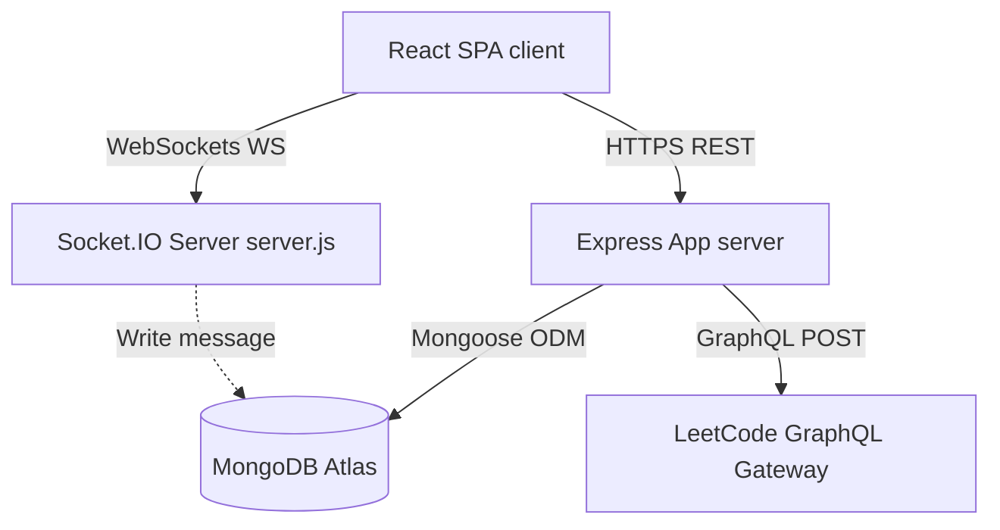
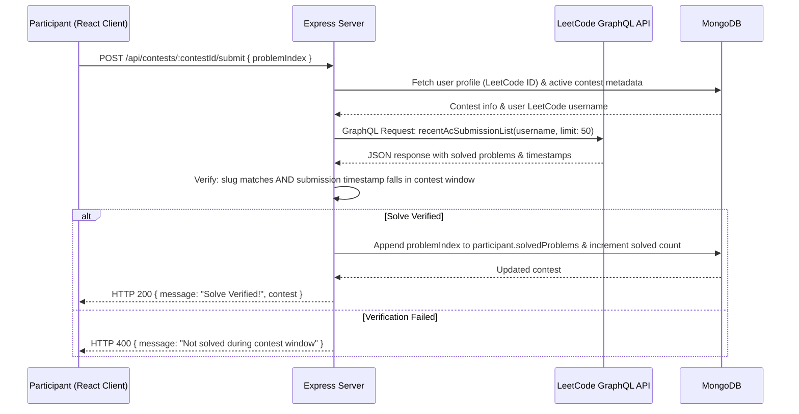

# CodeCircle ⭕

[](https://nodejs.org/)
[](https://react.dev/)
[](https://mongoosejs.com/)
[](https://socket.io/)
[](https://opensource.org/licenses/ISC)

CodeCircle is a production-ready, real-time collaborative coding platform designed for competitive programmers, interview prep groups, and coding communities. It allows developers to create synchronized private rooms, chat across multiple channels, view live room leaderboards, and compete in mock coding contests where progress is verified programmatically and automatically using LeetCode's public GraphQL API.

By automating solve verification directly against a user's LeetCode submission history, CodeCircle eliminates the friction of manual progress tracking, screenshots, or honor-system verification, providing a high-fidelity competitive environment.

---

## 📖 Table of Contents
1. [Overview](#-overview)
2. [Key Features](#-key-features)
3. [Tech Stack](#-tech-stack)
4. [System Architecture](#-system-architecture)
5. [Project Structure](#-project-structure)
6. [Database Design](#-database-design)
7. [API Documentation](#-api-documentation)
8. [Core Workflows](#-core-workflows)
9. [Technical Highlights & Engineering Decisions](#-technical-highlights--engineering-decisions)
10. [Challenges & Solutions](#-challenges--solutions)
11. [Installation & Setup](#-installation--setup)
12. [Configuration & Environment](#-configuration--environment)
13. [Usage](#-usage)
14. [Testing Strategy](#-testing-strategy)
15. [Future Improvements](#-future-improvements)
16. [Author](#-author)

---

## 🔍 Overview

Competitive programming is often a solitary activity, and coordinating group practice sessions or mock interviews is highly fragmented. Typically, organizers manually select problems, distribute links, and ask participants to post screenshots or paste code to verify their answers. 

**CodeCircle** solves this problem by merging **real-time communication (Socket.io)** with **external data integration (LeetCode GraphQL API)**. Users can gather in a room, chat in themed sub-channels, and participate in timed coding contests. When a user completes a problem on LeetCode, CodeCircle scrapes their public submission timeline in real-time, validates the timestamp against the contest window, updates the scoreboard, and awards persistence badges automatically.

---

## 🌟 Key Features

*   **Secure Coding Rooms**: Create private spaces that generate a 6-character alphanumeric code. Users can join rooms and participate in community leaderboards only after linking their LeetCode profile.
*   **Segmented Real-Time Chat Channels**: Communicate across multiple channels inside a room (e.g., `#general`, `#solutions`, `#random`) powered by WebSocket protocol.
*   **Automated LeetCode Verification**: Solve questions directly on LeetCode, click "Mark Solved" in the CodeCircle UI, and the server fetches recent submissions via GraphQL to verify the solution during the active contest window.
*   **Cron-Like Contest Scheduler**: A background interval agent automatically audits expiring contests every minute, ranks participants based on solved counts, and updates the database.
*   **Gamified Badge System**: Users earn 1st Place (Winner) and 2nd Place (Second) badges on their profiles, which dynamically update upon contest completion.
*   **Interactive Room Leaderboard**: Sorts room members by their lifetime solved counts and LeetCode ratings, generating healthy competition.

---

## 🛠 Tech Stack

### Frontend
*   **Core**: React 19.1.0 (Functional Components, Hooks)
*   **Build Tool**: Vite 7.0.4
*   **Styling**: Tailwind CSS 3.4.17, PostCSS, Autoprefixer
*   **State Management**: React Context API (`AuthContext`)
*   **Libraries**: Framer Motion (for animations), Lucide React (icons), Radix UI primitives (Dialog, Slot, Tabs)

### Backend
*   **Server Framework**: Express 5.1.0 (utilizing ES Modules)
*   **Real-time Communication**: Socket.io 4.8.1 (WebSocket abstraction)
*   **Utility Client**: Axios & Node-Fetch

### Database
*   **Database**: MongoDB Atlas (Cloud Database)
*   **Object Modeling**: Mongoose 8.16.4

### External Integration
*   **Third-Party API**: LeetCode GraphQL endpoint (`https://leetcode.com/graphql`)

---

## 🏗 System Architecture

CodeCircle is built on a decoupled Client-Server architecture utilizing WebSockets for state synchronization and a REST API for transactional operations.

### High-Level Topology


### LeetCode Verification Flow


---

## 📂 Project Structure

```
CodeCircle/
├── client/                     # Frontend SPA code
│   ├── public/                 # Static assets
│   ├── src/
│   │   ├── assets/             # Images and local styles
│   │   ├── components/         # Reusable UI widgets
│   │   │   ├── ui/             # Core Radix/Tailwind components (Button, Input, Card)
│   │   │   ├── Background.jsx  # Animated styling canvas
│   │   │   ├── CTABanner.jsx   # Call to Action component
│   │   │   ├── ContestPanel.jsx# Reusable contest panel (modular reference code)
│   │   │   ├── Features.jsx    # Explains project features
│   │   │   ├── Footer.jsx
│   │   │   ├── HeroSection.jsx # App landing header
│   │   │   ├── HowItWorks.jsx  # Visual guide for users
│   │   │   └── Navbar.jsx
│   │   ├── context/
│   │   │   └── AuthContext.jsx # Global user authentication & sync hook
│   │   ├── lib/
│   │   │   └── utils.ts        # Tailwind styling merges (clsx, tailwind-merge)
│   │   ├── pages/              # Routed page layouts
│   │   │   ├── CreateRoom.jsx  # Room generation page
│   │   │   ├── Dashboard.jsx   # Portal options
│   │   │   ├── Home.jsx        # Root landing page
│   │   │   ├── JoinRoom.jsx    # Room access screen
│   │   │   ├── Leaderboard.jsx # Dynamic leaderboard for room members
│   │   │   ├── Login.jsx
│   │   │   ├── ProfilePage.jsx # Syncing and showing user stats
│   │   │   ├── Register.jsx
│   │   │   ├── RoomChat.jsx    # Active channel chat and contest UI
│   │   │   ├── RoomResults.jsx # Completed contest lists and ranks
│   │   │   └── Rooms.jsx       # Lists user's rooms
│   │   ├── App.css
│   │   ├── App.jsx             # Main Router layout
│   │   ├── config.js           # API Base route configurations
│   │   ├── custom.d.ts
│   │   ├── index.css           # Styling entries
│   │   └── main.jsx
│   ├── package.json
│   ├── postcss.config.js
│   ├── tailwind.config.js
│   └── vite.config.js
└── server/                     # Backend API & WebSocket server
    ├── config/
    │   └── db.js               # MongoDB connection setup
    ├── controllers/
    │   └── userController.js   # User registration and verification
    ├── middleware/
    │   ├── authMiddleware.js   # Bearer JWT verification
    │   └── isAdmin.js          # Room admin authorization
    ├── models/                 # Database Schema definitions
    │   ├── Channels.js
    │   ├── Contest.js
    │   ├── Message.js
    │   ├── Room.js
    │   └── User.js
    ├── routes/                 # API endpoint routers
    │   ├── auth.js
    │   ├── channelRoutes.js
    │   ├── contestRoutes.js
    │   ├── leetcodeRoutes.js
    │   ├── messageRoutes.js
    │   ├── roomRoutes.js
    │   └── userRoutes.js
    ├── utils/
    │   ├── finishContest.js    # Auxiliary finalization helper
    │   └── generateInviteCode.js# Invite code generator
    ├── app.js                  # Express setup
    ├── server.js               # Socket.io setup, cron interval and server startup
    └── package.json
```

---

## 🗄 Database Design

We utilize MongoDB to handle dynamic schemas for chat logs, active contests, and user profiles.

### User Schema (`User`)
Tracks details, credentials, linked accounts, and cumulative performance badges.
| Field | Type | Description |
| :--- | :--- | :--- |
| `_id` | ObjectId | Auto-generated unique identifier |
| `username` | String | Unique username, required |
| `email` | String | Unique email address, required |
| `password` | String | Hashed password (Bcrypt) |
| `leetCodeId` | String | Linked LeetCode username |
| `totalSolved` | Number | Total problems solved on LeetCode |
| `contestRating`| Number | LeetCode rating |
| `globalRank` | Number | LeetCode Global Ranking |
| `contestsAttended` | Number | Count of official LeetCode contests attended |
| `badges` | Object | Nested structure: `{ winner: Number, second: Number }` |

### Room Schema (`Room`)
Defines coding rooms, members, and administrative privileges.
| Field | Type | Description |
| :--- | :--- | :--- |
| `_id` | ObjectId | Auto-generated unique identifier |
| `name` | String | Name of the room, required |
| `admins` | Array[ObjectId]| References to `User` model; room administrators |
| `inviteCode` | String | Unique 6-character access token |
| `createdBy` | ObjectId | Reference to `User` who instantiated the room |
| `members` | Array[ObjectId]| References to `User` model; joined members |

### Contest Schema (`Contest`)
Maintains problem metadata, temporal parameters, and live scoring checklists.
| Field | Type | Description |
| :--- | :--- | :--- |
| `_id` | ObjectId | Auto-generated unique identifier |
| `roomId` | ObjectId | Reference to the parent `Room` |
| `problems` | Array[Object] | Structured list of `{ title: String, url: String, slug: String, difficulty: String }` |
| `startTime` | Date | Start timestamp of the contest |
| `endTime` | Date | End timestamp of the contest (default: `startTime + 2 hours`) |
| `createdBy` | ObjectId | Reference to `User` who started the contest |
| `participants`| Array[Object] | Solved states: `{ user: ObjectId, solved: Number, rank: Number, solvedProblems: Array[Number] }` |
| `finished` | Boolean | Lifecycle flag. Defaults to `false` |

---

## 🔌 API Documentation

All routes (except `/api/users/register` and `/api/users/login`) require a valid JWT token passed via the `Authorization: Bearer <TOKEN>` header.

### Authentication & Users
*   **POST** `/api/users/register`
    *   *Payload*: `{ username, email, password }`
    *   *Response*: Returns a message, user object, and signed JWT token.
*   **POST** `/api/users/login`
    *   *Payload*: `{ email, password }`
    *   *Response*: Returns a message, user details, and signed JWT token.
*   **GET** `/api/auth/me`
    *   *Response*: Decodes the JWT token and returns user credentials and synced LeetCode stats.

### LeetCode Profile Operations
*   **GET** `/api/leetcode/:username`
    *   *Response*: Retrieves public LeetCode profile numbers (easy, medium, hard, total, rating, globalRank).
*   **POST** `/api/leetcode/update`
    *   *Payload*: `{ leetCodeId }`
    *   *Response*: Syncs data from LeetCode and saves it to the database for the active user.
*   **GET** `/api/leetcode/room-leaderboard/:roomId`
    *   *Response*: Retrieves members in a room sorted by their lifetime solved counts.

### Room & Channel Management
*   **POST** `/api/rooms/create`
    *   *Payload*: `{ name }`
    *   *Response*: Creates a room with a randomly generated invite code and assigns the creator as administrator.
*   **POST** `/api/rooms/join`
    *   *Payload*: `{ inviteCode }`
    *   *Response*: Adds user to room members if they have linked a LeetCode account.
*   **GET** `/api/rooms/my-rooms`
    *   *Response*: Returns a list of rooms the logged-in user has joined.
*   **GET** `/api/rooms/:roomId`
    *   *Response*: Fetches structural metadata for a room.
*   **POST** `/api/channels/create`
    *   *Payload*: `{ name, roomId }`
    *   *Response*: Creates a sub-channel under the specified room.
*   **GET** `/api/channels/:roomId/channels`
    *   *Response*: Retrieves list of channels configured for a room.
*   **GET** `/api/messages/:channelId`
    *   *Response*: Retrieves message logs for a channel, ordered chronologically.

### Contests Lifecycle
*   **POST** `/api/contests/:roomId/create` (Admin only)
    *   *Payload*: `{ problems: [{ title, url, difficulty }] }` (Exactly 3 problems)
    *   *Response*: Creates a 2-hour contest, parsing URL strings to map problem slugs.
*   **GET** `/api/contests/:roomId/active`
    *   *Response*: Fetches the current ongoing contest in a room.
*   **POST** `/api/contests/:contestId/submit`
    *   *Payload*: `{ problemIndex }`
    *   *Response*: Query-scrapes recent submissions from LeetCode, compares timestamps against the contest duration, and returns success if a solve is verified.
*   **POST** `/api/contests/:contestId/finish` (Admin only)
    *   *Response*: Manually terminates a contest and awards user profile badges.
*   **GET** `/api/contests/:roomId/latest`
    *   *Response*: Fetches results of the most recently ended contest in a room.

---

## 🔄 Core Workflows

### Phase 1: Authentication & Sync
1.  **Register/Login**: Users sign up and receive a JSON Web Token.
2.  **LeetCode Association**: In the profile dashboard, users input their LeetCode ID. The backend queries `https://leetcode.com/graphql` to verify the account's validity, populating their total solved count and ranking into the database.

### Phase 2: Room & Channel Engagement
1.  **Room Entry**: A user inputs a 6-character room code. The system checks if they have a linked LeetCode ID; if verified, they are added to the room membership.
2.  **Real-Time Interactions**: Selecting a channel triggers a WebSocket subscription (`joinChannel`). Message logs load via REST, while incoming messages are received in real-time (`receiveMessage`).

### Phase 3: The Contest Lifecycle
```
[Admin Creates Contest] -> [Participants Solve on LeetCode.com] -> [Click "Mark Solved" on CodeCircle]
         │                                                                       │
         ▼                                                                       ▼
[2-Hour Window Opens]                                                  [Server scrapes GraphQL API]
         │                                                                       │
         │                                                                       ▼
         │                                                            [Validate timestamp & slug]
         │                                                                       │
         ▼                                                                       ▼
[Autofinish cron interval checks] <--------------------------------- [Update leaderboard score]
         │
         ▼
[Badges awarded to Winner & Runner-up]
```

---

## ⚡ Technical Highlights & Engineering Decisions

### 1. Programmatic Solve Verification (External GraphQL Integration)
Instead of forcing users to copy-paste code or relying on manual validation, CodeCircle queries LeetCode's GraphQL server dynamically. It maps problems to their `titleSlug` using regex parsers:
```javascript
function extractSlugFromUrl(url) {
  const match = url.match(/leetcode\.com\/problems\/([\w-]+)/);
  return match ? match[1] : "";
}
```
During verification, the backend queries the user's recent submissions:
```graphql
query recentAcSubmissions($username: String!) {
  recentAcSubmissionList(username: $username, limit: 50) {
    title
    titleSlug
    timestamp
  }
}
```
The system validates that the matched `titleSlug` matches the question slug and that the timestamp of the submission falls inside the contest's start and end times.

### 2. State Synchronization via WebSockets
Real-time messages bypass REST polling entirely. Socket connections are dynamically instantiated using JWT auth headers upon mounting:
```javascript
const s = io(`${API_BASE}`, {
  auth: { token },
});
```
This reduces HTTP request overhead and updates client channels instantaneously.

### 3. Background Auditing Agent (Automatic Contest Sweeper)
Contest termination does not require manual administrator intervention. A lightweight, background interval process runs on the server every 60 seconds. It looks for ended contests, processes the rankings, awards badges, and commits the finished state to the database:
```javascript
setInterval(async () => {
  const now = new Date();
  const toFinish = await Contest.find({
    endTime: { $lte: now },
    finished: { $ne: true },
  });
  for (const c of toFinish) {
    await finishContest(c);
  }
}, 60000);
```

---

## ⚠️ Challenges & Solutions

### 1. The Multi-Channel Message Leakage (WebSocket Room Leak)
*   **Problem**: In `client/src/pages/RoomChat.jsx`, the client emits a `leaveChannel` event upon switching channels to clean up previous subscriptions. However, the Express/Socket.io backend lacks a handler for `leaveChannel`. Consequently, the socket remains joined to every channel room it visits during a session, causing the user to receive messages from multiple channels simultaneously.
*   **Solution**: Update the backend Socket.io connection logic in `server.js` to handle `leaveChannel`:
    ```javascript
    socket.on("leaveChannel", ({ roomId, channelId }) => {
      if (channelId) {
        socket.leave(channelId);
        console.log(`⬅️ Socket ${socket.id} left channel ${channelId}`);
      }
    });
    ```

### 2. Idempotency Bugs in Manual Contest Termination
*   **Problem**: The REST endpoint `POST /api/contests/:contestId/finish` manually closes contests. However, this route does not set `contest.finished = true` in the database, nor does it check if a contest was already closed. Hitting this endpoint repeatedly continuously increments the badge counts of the first and second-place winners.
*   **Solution**: Implement an idempotency check at the top of the `/finish` route and ensure the `finished` flag is updated:
    ```javascript
    if (contest.finished) {
      return res.status(400).json({ message: "Contest already finished" });
    }
    contest.finished = true;
    // ... award badges ...
    await contest.save();
    ```

### 3. Hardcoded Socket CORS Settings
*   **Problem**: The Socket.io server configuration in `server.js` contains a hardcoded CORS origin pointing to `"https://code-circle.onrender.com"`. This prevents developers from establishing WebSocket connections during local testing on `localhost`.
*   **Solution**: Refactor the CORS config to draw from environment variables, fallback-defaulting to localhost:
    ```javascript
    const originUrl = process.env.FRONTEND_URL || "http://localhost:5173";
    const io = new Server(server, {
      cors: {
        origin: originUrl,
        methods: ["GET", "POST"],
        credentials: true,
      },
    });
    ```

### 4. GraphQL Rate Limiting and Submissions Cache-misses
*   **Problem**: LeetCode's unofficial API has rate limits and only returns the 50 most recent submissions. If a participant solves a contest question but makes more than 50 submissions on other problems before clicking "Mark Solved", their submission disappears from the verified list.
*   **Solution**: Advise users to click "Mark Solved" immediately after resolving a question. In future iterations, implementing a background worker to poll submission history during active contests will prevent this cache-miss issue.

---

## 🚀 Installation & Setup

### Prerequisites
*   Node.js (v18.0.0 or higher)
*   MongoDB Instance (Local database or MongoDB Atlas Cloud URI)

### 1. Clone the repository
```bash
git clone https://github.com/yourusername/CodeCircle.git
cd CodeCircle
```

### 2. Install Backend Dependencies
```bash
cd server
npm install
```

### 3. Install Frontend Dependencies
```bash
cd ../client
npm install
```

---

## ⚙️ Configuration & Environment

Create a `.env` file in the `server` directory:

```env
PORT=5000
MONGO_URI=mongodb+srv://<USERNAME>:<PASSWORD>@<CLUSTER>.mongodb.net
JWT_SECRET=your_jwt_signing_secret_key
FRONTEND_URL=http://localhost:5173
```

Create a `.env` file in the `client` directory:

```env
VITE_API_URL=http://localhost:5000
```

---

## 💻 Usage

### Local Development
To run both the server and client concurrently in development mode:

1.  **Start the Backend Express Server**:
    ```bash
    cd server
    npm run dev
    ```
    This launches the backend server using nodemon on `http://localhost:5000`.

2.  **Start the Frontend Vite Dev Server**:
    ```bash
    cd client
    npm run dev
    ```
    This launches the React app on `http://localhost:5173`.

### Production Deployment
To build the application for deployment:
```bash
cd client
npm run build
```
Deploy the compiled client static folder in `client/dist` to a CDN or host, and run `npm start` on your backend server.

---

## 🧪 Testing Strategy

Currently, the project is structured for manual validation. For production releases, the following automated testing setup is recommended:

1.  **API Integration Tests (Backend)**:
    Install `jest` and `supertest` to test JWT authentication, contest validation, and room management APIs.
    ```bash
    npm install --save-dev jest supertest
    ```
2.  **Component Tests (Frontend)**:
    Use `vitest` and `@testing-library/react` to test context behavior and rendering under mock user states.
    ```bash
    npm install --save-dev vitest @testing-library/react
    ```
3.  **Mocking GraphQL Requests**:
    Use `msw` (Mock Service Worker) to intercept requests to `https://leetcode.com/graphql` and simulate correct user timelines during testing.

---

## 🔮 Future Improvements

*   **Distributed Task Schedulers**: Migrate the stateful `setInterval` background agent to a robust, Redis-backed job system (e.g., BullMQ) to support multi-instance horizontal scaling.
*   **Idempotency & Transactions**: Wrap badge updates and contest status modifications in MongoDB multi-document transactions to guarantee database write safety.
*   **WebSocket Authentication Middleware**: Secure Socket.io connections during handshakes using custom JWT checks instead of handling authorizations late.
*   **Rich Text & Media Messaging**: Add support for sharing snippets, images, and rich formatting inside channels.

---

## 👤 Author

*   **Rohan Singh** - *Creator & Lead Maintainer* - [GitHub](https://github.com/Rohan-Singh-mysteriouschemistic)

---
*Created as a portfolio piece showing full-stack system design, WebSocket networking, and third-party API parsing.*
